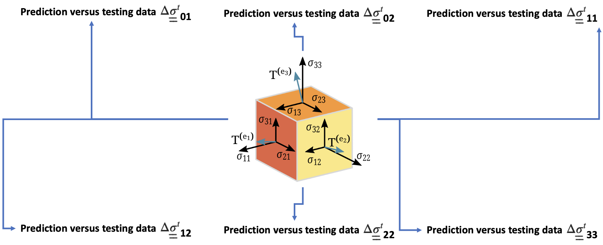
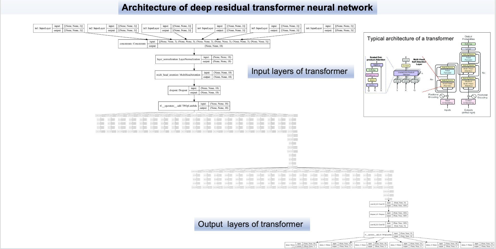
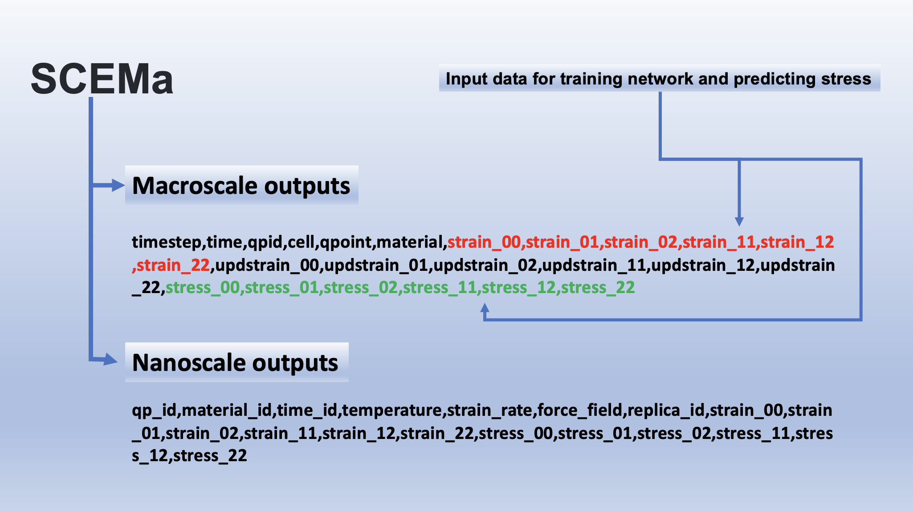
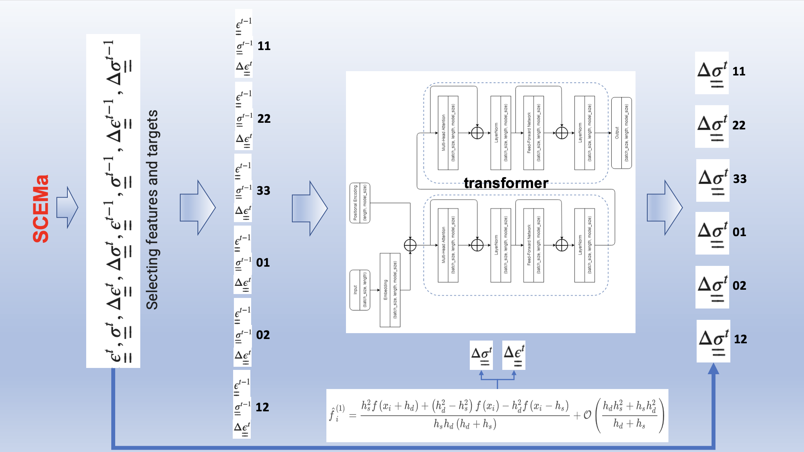

[](https://github.com/UCL-CCS/DRTNN/issues)
[](https://github.com/UCL-CCS/DRTNN/network)
[](https://github.com/UCL-CCS/DRTNN/stargazers)
[](https://github.com/UCL-CCS/DRTNN/blob/master/LICENSE)


# [Deep Residual Transformer Neural Network (DRTNN)]


<p float="center">
  
   
  
</p>

<br>
 
</br>

<p float="center">
  
   
  
</p>


<br>
 
</br>

#  Neural transformer network for predicting stress!

<br>
 
</br>


<br>
 
</br>


# Running the Program! 

User needs first to install Anaconda https://www.anaconda.com/

Then


```sh
  - conda env create -f environment.yml
  or
  - conda create --name traintest --file Building_identical_conda_environment-file.txt
``` 
and 

```sh
  - conda activate traintest
``` 
finally

```sh
  - python  main.py
``` 

